# Analytics Services

Analytics services provides analytical REST services and plotted Graphs for provided dataset. It uses powerful Python libraries such as [Pandas](https://pandas.pydata.org/) and [scikit-learn](https://scikit-learn.org/) to analyze the data. The services are developed using the [Django Rest Framework](https://www.django-rest-framework.org/) is widely used Rest API platform in Python. It also provides in-built authentication, serialization, ORM and web browsable API view. The project demonstrates data analysis and machine learning capabilities.

### Setup PostgreSQL Server

* Download latest [Windows PostgreSQL Installer](https://www.postgresql.org/download/windows/) and follow windows installation steps.
* Alternatively, can download [Windows PostgreSQL Binary Archive](https://www.enterprisedb.com/download-postgresql-binaries) and extract the zip file. POSTGRE_SQL_HOME is the path to the unzipped PostgreSQL **pgsql** directory.
* Create `data` directory in `POSTGRE_SQL_HOME/pgsql` and initialize the postgres database using `pg_ctl init` command from [pg_ctl](https://www.postgresql.org/docs/9.5/static/app-pg-ctl.html) utility.

        $ pg_ctl -D "POSTGRE_SQL_HOME/pgsql/data" init

* Start the Posgres server in background with the initialized data directory. PostGreSQL runs by default on port 5432.

        $ pg_ctl -D "POSTGRE_SQL_HOME/pgsql/data" -l logfile start

* Create default `postgres` as superuser and set the password as `secret`.

        $ createuser --password --superuser postgres

* Alternatively, the password of `postgres` user can be changed as below after logging into psql.

        $ psql -U postgres
        postgres=#  \password
        postgres=#  ALTER USER postgres WITH PASSWORD 'new_password';

* Register Posgres server with data directory path as a windows service.

        $ pg_ctl register -N postgres -D "POSTGRE_SQL_HOME/pgsql/data"
        
* Create a new user named **appuser** and new database named **appdb** using below **psql** commands.

        $ psql -U postgres
        postgres=#  CREATE USER appuser WITH PASSWORD 'secret123';

* Create a new database `appdb` and grant all privileges for the database to user `appuser`. user named **appuser** and new database named **appdb** using below **psql** commands.

        postgres=#  CREATE DATABASE appdb;
        postgres=#  GRANT ALL PRIVILEGES ON DATABASE appdb TO appuser;
        postgres=#  \c appdb;

* Alternatively, database can be created using the [createdb](https://www.postgresql.org/docs/9.1/app-createdb.html) utility as below. Then login into psql with appuser and appdb database.

        $ createdb --owner appuser appdb
        $ psql -h localhost -U appuser -d appdb
        postgres=#  \q

* To remove the user `appuser` and database `appuser`, login into psql using `postgres` superuser and execute below drop commands.

        $ psql -U postgres
        postgres=#  DROP DATABASE appdb;
        postgres=#  DROP USER appuser;

**NOTES** 
- While running `pg_ctl.exe register` command, please ensure that the windows command prompt is running as administrator, to avoid `pg_ctl: could not open service manager` error.
- If the data directory is not initialized pg_ctl returns the error `pg_ctl: directory "C:/Installs/pgsql/data" is not a database cluster directory`.
- The `postgres` user is not created by default and hence should be created using [createuser](https://www.postgresql.org/docs/12/app-createuser.html) utility to avoid the `FATAL:  role "postgres" does not exist` error.
 

### Running Redis Server

* Download the latest stable [windows release](https://github.com/MicrosoftArchive/redis/releases) or follow [installation instructions](https://redis.io/topics/quickstart) for linux platforms.
* Start the redis server using below command. Redis by default runs on port 6379.

        $ redis-server

* The [Redis CLI](https://redis.io/topics/rediscli) is used to communicate with redis instance. Redis CLI connects to the server at 127.0.0.1 and port 6379 by default.
  It also allows to connect to different host using -h option and different port using the -p option. The -n <dbnum> option operates 
  the command on a database number other than the default number zero. 

        $ redis-cli -h redis.server.com -p 6390 ping
        $ redis-cli -n 1
  
* Redis enables print all the key names in the keyspace using keys command, or scan & filter the keys for specific patterns.

        $ redis-cli keys *
        $ redis-cli --scan --pattern '*-11*'

* To get value of the key, first use the [type](https://redis.io/commands/type) command to determine the key's value type. Then use the corresponding commands 
  depending on the key type to fetch the value.

        $ redis-cli type <key-name>
  
  - To get "string" value: `get <key>`
  - To get "hash" value: `hgetall <key>`
  - To get "list" value: `lrange <key> 0 -1`
  - To get "set" value: `smembers <key>`
  - To get "zset" value: `zrange <key> 0 -1 withscores`

* In order to create a new key or update (overwrite) the value of existing key the [set](https://redis.io/commands/set) command is used. 
  The `ex` option allows to set the expiration time for the key. The [del](https://redis.io/commands/del) command is used to delete the key.

        $ redis-cli set mykey "Hello"
        $ redis-cli set anotherkey "will expire in a minute" ex 60
        $ redis-cli del mykey anotherkey

* The [FlushDB](http://redis.io/commands/flushdb) command is used to delete all keys from the connection's current database.
  The [FlushAll](http://redis.io/commands/flushall) command deletes all keys from all databases.

        $ redis-cli flushdb
        $ redis-cli flushall
        $ redis-cli flushall async
        
* The redis stats option provides the real time information of the redis instances.

        $ redis-cli --stats
        
*  The redis monitoring mode prints all the commands received by a Redis instance. The basic latency checking tool is the --latency option
   which measures the time taken to receive a reply for a ping from the redis instance.

        $ redis-cli monitor
        $ redis-cli --latency
        
### Running Django Services

Below are the instructions to download/setup Python3, PIP, Poetry and to run Django Services using command line.

* Download the latest [Python3 Release](https://www.python.org/downloads/) and install it. It is recommended to use installer rather than standalone version for windows machine.
* Install PIP using the below command.

        $ python get-pip.py

* Install Poetry using PIP as below.

        $ pip install poetry

* Install all the python packages by reading the `pyproject.toml` file in the project directory. 
  Subsequently run all the commands with `poetry run` prefix command, in order to run them in poetry's virtual environment. 
  Run Django's `makemigrations`, `migrate` and `runserver` commands as below to setup and run django rest services.

        $ poetry install
        $ poetry run python manage.py makemigrations
        $ poetry run python manage.py migrate
        $ poetry run python manage.py runserver

* Alternatively, if want to start a fresh project `analytics-services` and create an app `api` for example, can be achieved using below commands. 

        $ poetry run django-admin startproject analytics-services
        $ poetry run django-admin startapp api

### Accessing Django Admin Page

* Create a new super user `admin` with the password `secret123`:

        $ poetry run python manage.py createsuperuser --email admin@emprovise.com --username admin

* Access the Admin page at [http://localhost:8000/admin](http://localhost:8000/admin)

### Register new user

* In order to create a new user, first login into [Admin page](http://localhost:8000/admin) using the super user credentials 
  created earlier.

* Go to sign up page at [http://localhost:8000/signup/](http://localhost:8000/signup/) and fill in the username, password, 
  email and other details. After submitting the form by clicking on post, a new user is created.

* Login at [http://localhost:8000/api-auth/login/](http://localhost:8000/api-auth/login/) with the new user.

### Register an application

To obtain a valid access_token for an application, we need to register the application. The Django OAuth Toolkit has a set of 
customizable views we can use to CRUD application instances.

   - Go to [http://localhost:8000/o/applications/](http://localhost:8000/o/applications/)
   - Click on the link to create a new application which will take to a form. Fill the form with the following data and save:
        - Name: just a name of your choice
        - Client Type: confidential
        - Authorization Grant Type: Resource owner password-based

   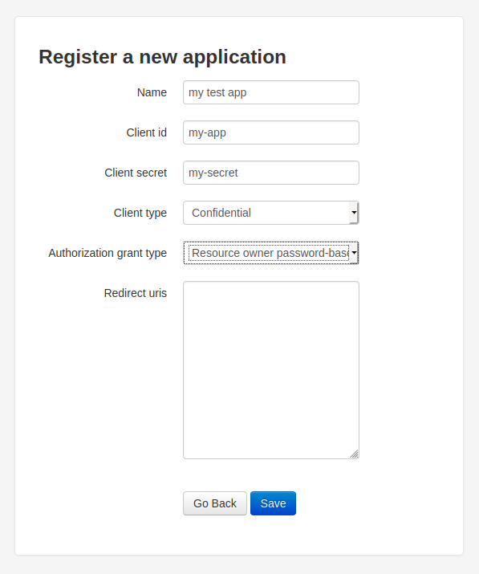

### Testing OAuth2 using HTTPie

   - Install [HTTPie](https://httpie.org/), command-line HTTP client for the API with JSON support.

        $ pip install httpie

   - Generate a new Oauth token by calling the endpoint [http://localhost:8000/o/token/](http://localhost:8000/o/token/) and passing 
     the `client_id` and `client_secret` from the application registered above. The `username` and `password` is the user created 
     using the http://, and `grant_type` is `password`. The HTTPie's `-v` option represents verbose, while `-f` option represents 
     form request. 

    $ http -v -f POST http://localhost:8000/o/token/ 'client_id=<clientId>' 'client_secret=<clientSecret>' 'grant_type=password' 'username=admin' 'password=secret123'

    {
        "access_token": "dSCqdRi7y9wxRy4AWMh3klpgFEzBGj",
        "expires_in": 36000,
        "refresh_token": "0u3mnJBGfdTKcgLpxR6f8WNEajEkaK",
        "scope": "read write groups",
        "token_type": "Bearer"
    }

   - Use the `access_token` from the above response to pass as bearer authorization for the /users, /users/id and /groups services.

    $ http -v localhost:8000/users/ Authorization:"Bearer <access_token>" Accept:application/json

   - We can also use Google Chrome to browse the HTTP GET APIs. In order to do that, we need to install the [ModHeader Google Chrome Extension](https://chrome.google.com/webstore/detail/modheader/idgpnmonknjnojddfkpgkljpfnnfcklj?hl=en) 
     into Google chrome. Once installed click on the `ModHeader` Extension, and under Request Headers, add `Authorization` with the 
     value as `Bearer <access_token>` were `access_token` is taken from step 2.     
     
   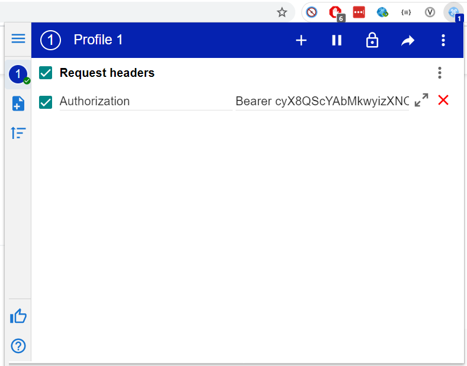

### Import Data into Database

Django import export package is used to import data from csv, json, excel and other formats into the database.
In order to import the data file into the database, the corresponding django database model and the resource model 
should be added into the application. Currently only `/data/vgsales.csv` can be imported into the database using the
`VideoGameSales` model. To begin the import of data from csv file we follow below process.

1. Login to the Admin page at [http://localhost:8000/admin](http://localhost:8000/admin) and navigate to `Video Game Sales`
   under `API` application. 
2. Click on `import` button which gives below form. Select the `/data/vgsales.csv` file and select option as `csv`.  

   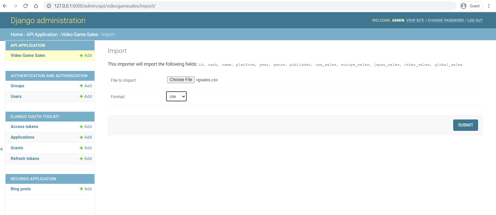

3. If the file data is valid with no errors, we see below page. Click `Confirm Import` to import all the data in `api_videogamesales` table.  

   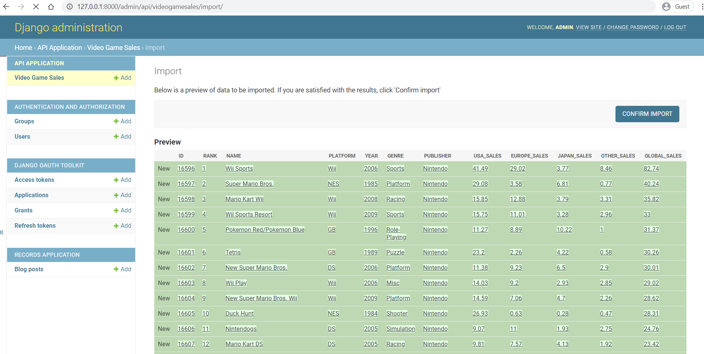

4. Once all the data is imported in `api_videogamesales` table successfully, we see the confirmation page as below. Ignore `Select the Video Game Sales to change` suggestion.  

   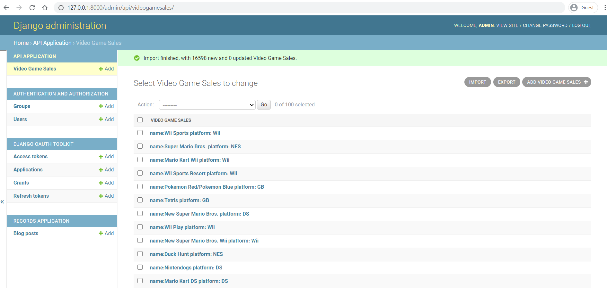

 
### List of Analytics Services

<table width="100%">
    <thead>
        <tr>
            <th>Resource</th>
            <th>Services</th>
            <th>Service Description</th>
        </tr>
    </thead>
    <tbody>
        <tr>
            <td rowspan=3>Users</td>
            <td>/users</td>
            <td>Returns all the users</td>
        </tr>
        <tr>
            <td>/users/[user-id]</td>
            <td>Returns the details of the requested user id</td>
        </tr>
        <tr>
            <td>/groups</td>
            <td>Returns all the list of groups</td>
        </tr>
        <tr>
            <td rowspan=2>BlogPost</td>
            <td>/api/postings/</td>
            <td>Returns all the blog postings present in blogpost</td>
        </tr>
        <tr>
            <td>/api/postings/[blog-post-id]/</td>
            <td>Returns details of the requested blogpost by blogpost id</td>
        </tr>
        <tr>
            <td rowspan=1>SuicideStatistics</td>
            <td>/api/suicide/statistics/</td>
            <td>Returns all the WHO suicide statistics records from data/who_suicide_statistics.csv</td>
        </tr>
        <tr>
            <td rowspan=2>VideoGameSales</td>
            <td>/api/videogames/sales/</td>
            <td>Returns video game sales records which can be analyzed using dataframe</td>
        </tr>
        <tr>
            <td>/api/videogames/sales/chart/</td>
            <td>Returns SVG chart based on passed chart (type) parameter</td>
        </tr>
    </tbody>
</table>

 
##### Video Game Sales - Analytics Services

The Video Game Sales API service supports below query parameters for data manipulation using Pandas.
All the below query parameters can be applied together or separately as shown in the below examples.

- Filter: It finds all the records that match the text in the `filter_value` parameter for the data column specified by `filter_column` parameter. 
- Group: It groups all the records by data column `group` and adds up all the values for the data columns `usa_sales`, `europe_sales`,`japan_sales`, `other_sales` and `global_sales`.
- Sort: It sorts the specified data column in the `sort` parameter.

[http://localhost:8000/api/videogames/sales/?filter_column=name&filter_value=Call%20of%20Duty&sort=year]()

[http://localhost:8000/api/videogames/sales/?group=genre&filter_column=name&filter_value=Call%20of%20Duty&sort=global_sales]()

### Type of Charts for Analytics

Analytics services provides various types of charts for all the video game sales analytics services. All the below supported charts 
can only be accessed using a web browser and requires bearer authorization to be passed in the headers. The 
`ModHeader Chrome Extension` mentioned before enables to pass the bearer authorization header for all the requests within the 
Google Chrome browser, thus enabling to view all the below charts. Each chart type requires some mandatory parameters to be 
passed in order for the chart to be rendered using the Video Game Sales dataframe.

Charts also support various custom styling by passing the `style` parameter with below [standard style values](https://matplotlib.org/3.3.2/tutorials/introductory/customizing.html).

[`Solarize_Light2`, `_classic_test_patch`, `bmh`, `classic`, `dark_background`, `fast`, `fivethirtyeight`, `ggplot`, `grayscale`, `seaborn`, `seaborn-bright`, `seaborn-colorblind`, `seaborn-dark`, `seaborn-dark-palette`, `seaborn-darkgrid`, `seaborn-deep`, `seaborn-muted`, `seaborn-notebook`, `seaborn-paper`, `seaborn-pastel`, `seaborn-poster`, `seaborn-talk`, `seaborn-ticks`, `seaborn-white`, `seaborn-whitegrid`, `tableau-colorblind10`]

#### Scatter Chart

[http://localhost:8000/api/videogames/sales/chart/?group=genre&chart=scatter&x=global_sales&y=europe_sales]()

   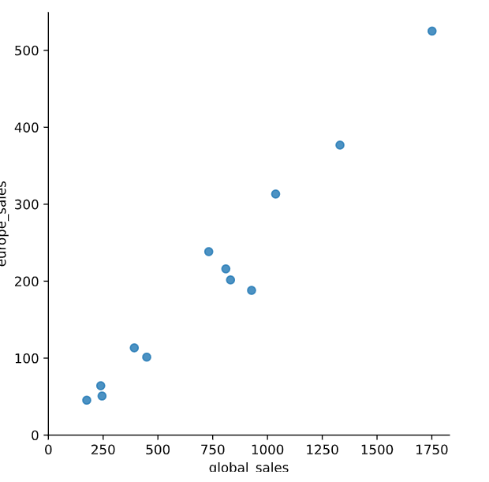

#### Box Chart

[http://localhost:8000/api/videogames/sales/chart/?group=genre&chart=box&x=global_sales&y=europe_sales]()

   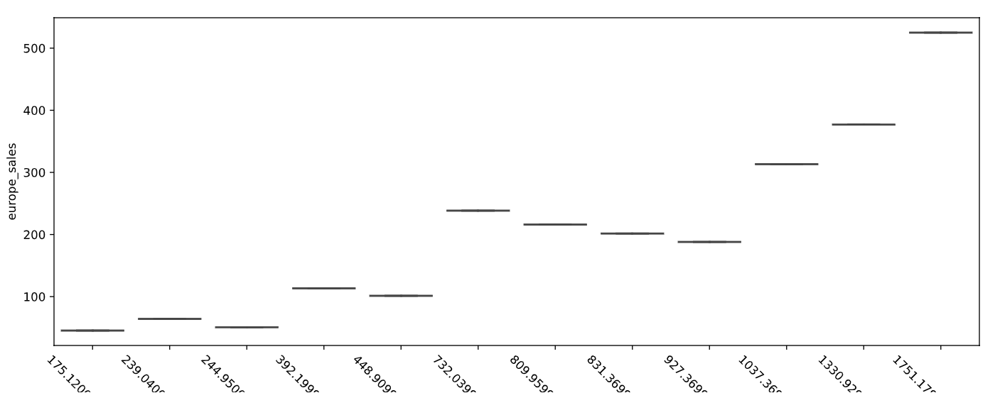

#### Swarm Chart

[http://localhost:8000/api/videogames/sales/chart/?group=genre&chart=swarm&x=global_sales&y=europe_sales]()

   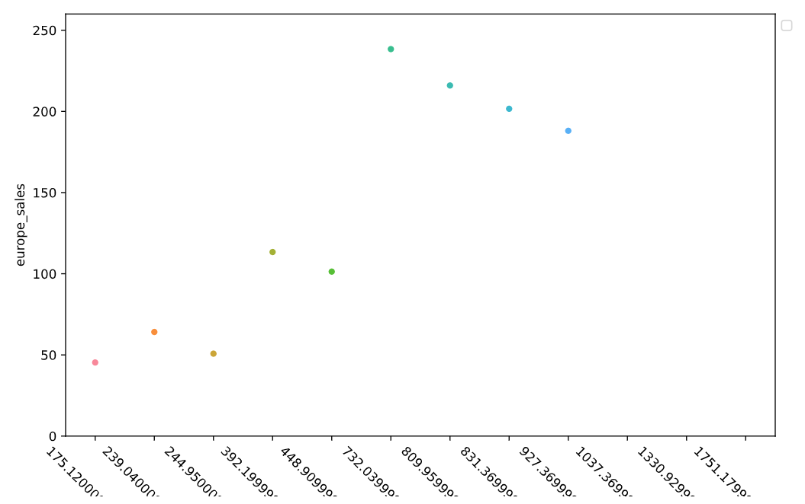

#### Joint Distribution Chart

[http://localhost:8000/api/videogames/sales/chart/?group=genre&chart=joint&x=global_sales&y=europe_sales]()

   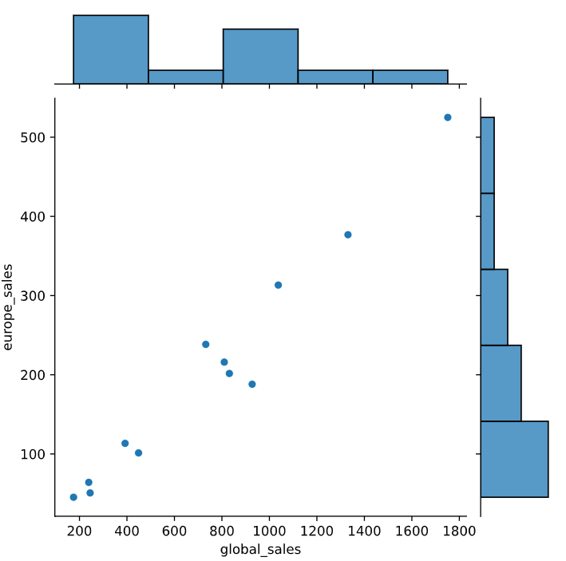

#### Histogram

[http://localhost:8000/api/videogames/sales/chart/?group=genre&chart=histogram&x=global_sales&y=europe_sales]()

   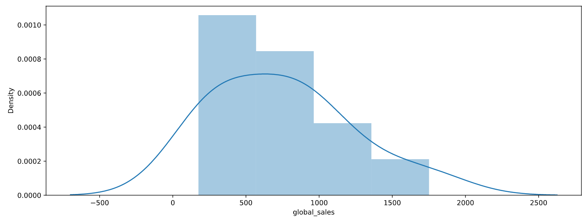

#### Bar Chart

[http://localhost:8000/api/videogames/sales/chart/?group=genre&chart=bar&x=global_sales&y=europe_sales&hue=usa_sales]()

   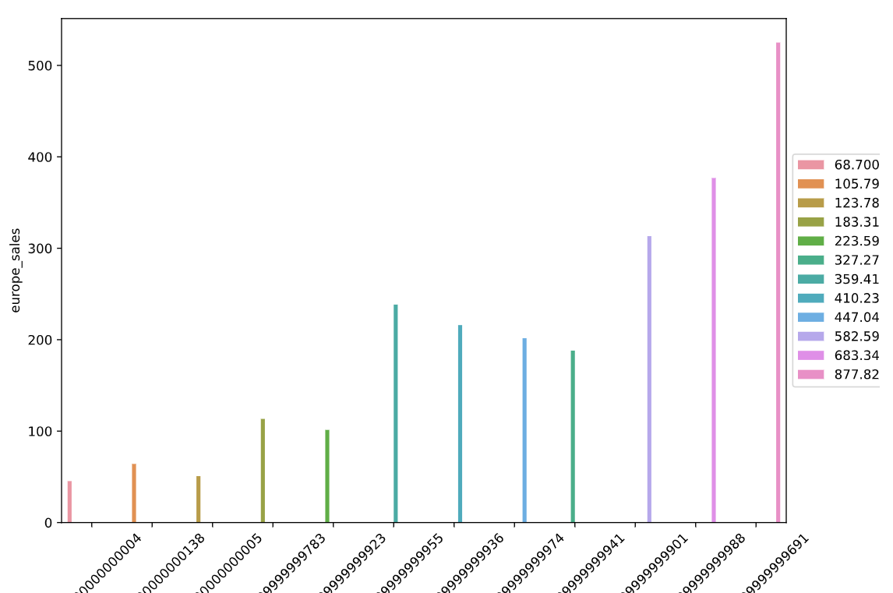

#### Pie Chart

[http://localhost:8000/api/videogames/sales/chart/?group=genre&chart=pie&y=europe_sales&style=Solarize_Light2]()

   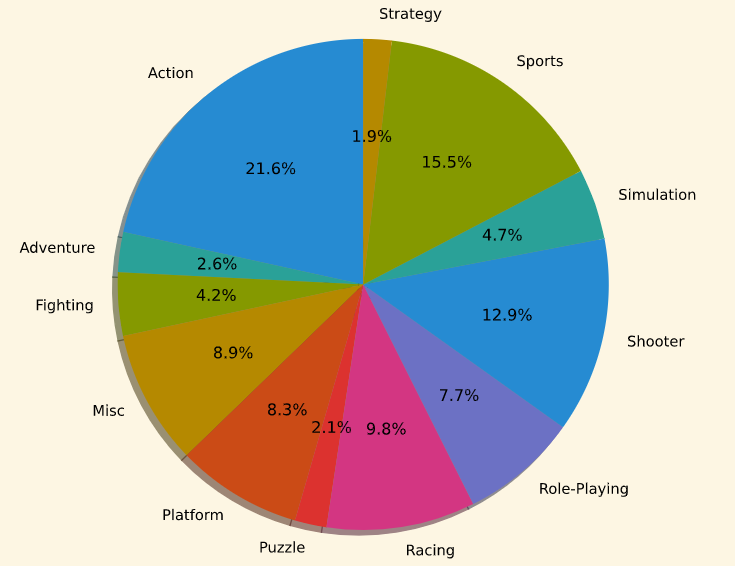

#### Line Chart

[http://localhost:8000/api/videogames/sales/chart/?group=genre&chart=line&x=japan_sales&y=europe_sales]()

   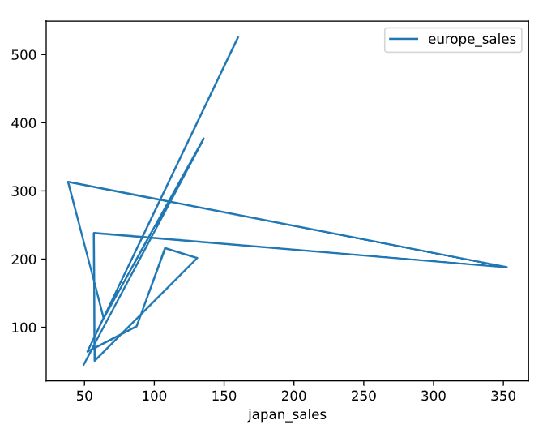

#### Category Chart

[http://localhost:8000/api/videogames/sales/chart/?group=genre&chart=category&x=global_sales&y=europe_sales]()

   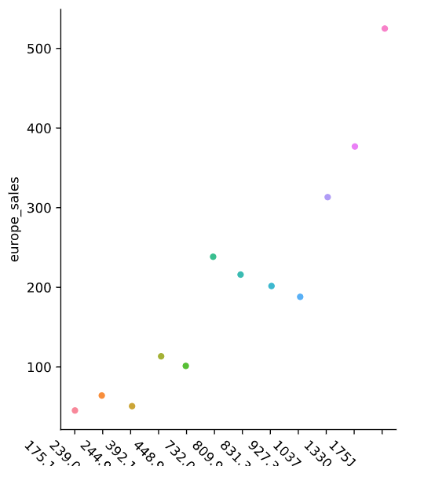

### Recreating deleted table in Django

- Delete the Django migrations directory within the app.
- Execute the below query to delete the record from django_migrations table.

    DELETE FROM django_migrations WHERE app = 'app_name';
    
- Then execute django migration commands as below for the app. 

    $ python manage.py makemigrations app_name
    $ python manage.py migrate

